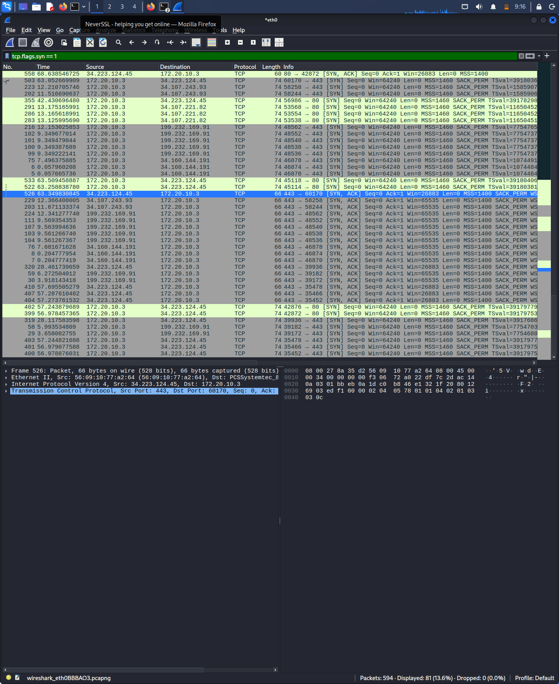

# 🤝 Day 15: Deep Dive into TCP Connection States

### 🔬 Technical Breakdown
Today I analyzed the **Transmission Control Protocol (TCP)**, specifically the 3-way handshake. Unlike UDP, TCP is connection-oriented, meaning it ensures a reliable path is established before data transfer begins.

**The Sequence:**
1. **SYN (Synchronize):** The client sends a sequence number to the server.
2. **SYN-ACK (Acknowledge):** The server responds, acknowledging the client and sending its own sequence number.
3. **ACK:** The client confirms, and the "Established" state is reached.

### 🛡️ Analyst Perspective (Recruiter Note)
Understanding this handshake is the foundation of detecting **Network Scanning**. When I see a high volume of SYN packets followed by RST (Reset) or no response, I flag this as a "Port Scan." Attackers do this to map which services (like SSH or HTTP) are open on our servers. 

**Evidence:**

