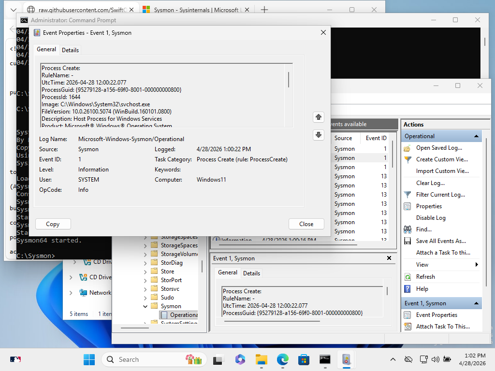

# Advanced Endpoint Monitoring with Sysmon #
# Objective 
To enhance Windows logging capabilities beyond standard Event Viewer defaults by deploying Microsoft Sysinternals Sysmon. This provides deep visibility into process creations, network connections, and file system changes—essential for detecting advanced persistent threats (APTs).

Technical Implementation
Tool: Sysmon (System Monitor)

Configuration: I Deployed Sysmon with a customized configuration file to filter out "noise" and focus on high-fidelity security events.

Key Event Captured: I also verified successful logging of Event ID 1 (Process Creation).

Evidence: Successfully tracked svchost.exe and other system processes, capturing critical metadata like ProcessGuid, Hashes, and ParentProcessId.

