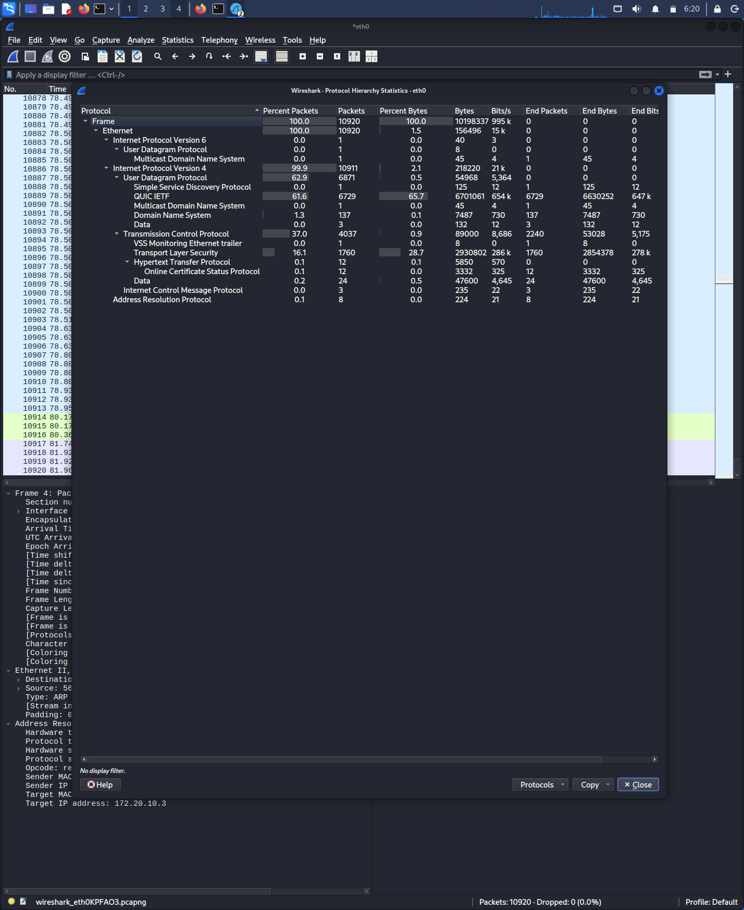

# 📊 Day 19: Protocol Hierarchy & Traffic Profiling

### 🔬 Technical Analysis
Today, I moved beyond individual packet inspection to analyze the **Protocol Hierarchy Statistics** of the network. This provides a high-level view of every protocol active during the capture, categorized by the OSI layers.

**Key Findings from my Analysis:**
* **QUIC/UDP Dominance:** I identified that over 60% of the traffic was using the QUIC protocol, which is standard for modern encrypted Google/YouTube services.
* **TCP vs. UDP Ratio:** By comparing the bytes sent over TCP versus UDP, I can establish a "Normal" baseline for this specific network segment.
* **Non-Standard Protocols:** I am looking for "Outliers"—protocols that shouldn't be here, such as BitTorrent or legacy protocols like Telnet.

### 🛡️ SOC Analyst Perspective
In a production SOC, this view is my "Health Check." If a web server suddenly shows 90% **SMB (File Sharing)** traffic instead of **HTTPS**, it is a massive indicator of **Lateral Movement** or **Internal Data Exfiltration**.

### 🖼️ Evidence

