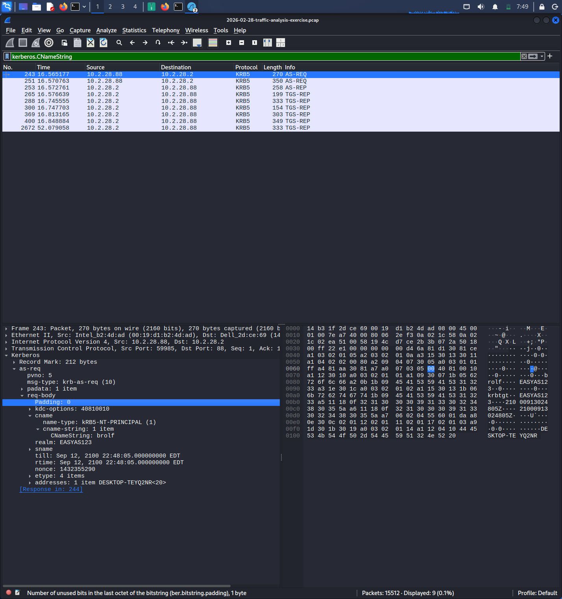

## 🕵️‍♂️ Phase 1: Victim Discovery
**Task:** Identify the internal host communicating with the known malicious IP `45.131.214.85`.
**Finding:** Host `10.2.28.2` was identified as the infected source.

[Victim Discovery](./Evidence/Victim_IP_Discovery.jpg)

---

## 🧬 Phase 2: Hardware & Host Identification
**Task:** Identify the physical machine and computer name.
**Finding:** The machine is a **Dell** device with MAC address `14:b3:1f:2d:ce:69`, registered as `DESKTOP-TEYQ2NR`.

---

## 👤 Phase 3: User Attribution
**Task:** Determine which user account was active during the compromise.
**Finding:** Kerberos analysis revealed the user account **brolf** was compromised.

---

## 🚩 Phase 4: Command & Control (C2) Analysis
**Task:** Analyze the traffic pattern and identify the malware family.
**Finding:** The traffic shows an HTTP POST beacon to the C2 server. The **User-Agent** confirms the use of **NetSupport Manager/1.3** as a Remote Access Trojan (RAT).

