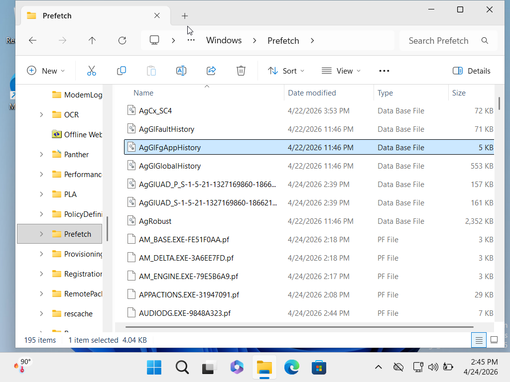

# 🏎️ Day 23: Windows Prefetch - Hunting for Evidence

### 🎯 Objective
To identify evidence of application execution through the Windows Prefetch directory.

### 🕵️‍♂️ Investigation: Proof of Concept
I explored `C:\Windows\Prefetch` to view the system's "execution receipts."

### 🧠 Major Forensic Discoveries:
* **The "Ghost" Effect:** I learned that even if a user deletes an executable (e.g., malware), the `.pf` file remains in this folder as evidence.
* **Metadata vs. Explorer:** While Windows Explorer shows the "Date Modified," a forensic tool is needed to see the **Execution Count** hidden inside the file.
* **Location Check:** Legitimate files like `AUDIODG.EXE` were found. If I saw a "system" file running from a user's `Downloads` folder in this list, it would be an immediate red flag.
