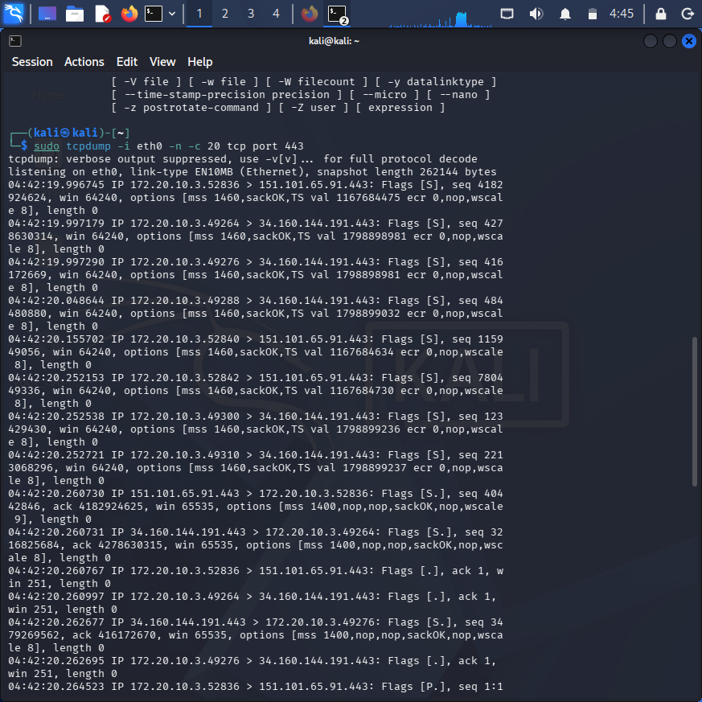

## Day 28: Network Traffic Analysis & TCP Handshake Verification ##
## 🛰️ Lab Overview ##

In this lab, I transitioned from host-based forensics to Network Traffic Monitoring. Using tcpdump, I captured and analyzed raw packets on the Kali Linux eth0 interface. The goal was to verify the TCP Three-Way Handshake and identify how applications establish secure connections at Layer 4 of the OSI model.

Technical Evidence
I executed a capture filtered for HTTPS traffic (port 443) to observe how my machine establishes secure sessions.

Command Used:
sudo tcpdump -i eth0 -n -c 20 tcp port 443

Analysis of Captured Handshake:
Looking at the output, I identified a successful connection to a Google Cloud server (34.160.144.191):

SYN: My IP 172.20.10.3 sent a connection request ([S]).

SYN-ACK: The server responded with permission ([S.]).

ACK: My machine finalized the connection ([.]).

Key Skills Demonstrated
Packet Sniffing: Proficient in using tcpdump for real-time monitoring.

Protocol Knowledge: Ability to decode TCP flags to identify connection states.

Network Forensics: Differentiating between normal traffic (Handshake completion) and potential threats like SYN Floods (Incomplete handshakes).
