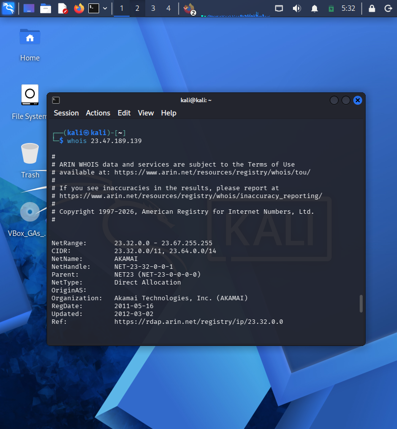

#  Network Traffic Analysis & Forensics

## 🎯 Learning Objectives
This week focused on transitioning from host-based analysis to **Network Forensics**. I mastered the ability to monitor raw data packets at Layers 2, 3, and 4 of the OSI model to identify both normal and malicious behavior.

---

##  Lab 1: TCP Handshake Verification
I used `tcpdump` to capture live traffic on the `eth0` interface to observe how secure connections (Port 443) are established.

**Command:**
`sudo tcpdump -i eth0 -n -c 20 tcp port 443`

**Forensic Observation:**
I successfully captured the **SYN -> SYN-ACK -> ACK** sequence, proving a successful connection between my machine (`172.20.10.3`) and a remote web server.

---

## 🔍 Lab 2: Forensic IP Attribution & Troubleshooting
In this lab, I acted as a SOC Analyst triaging an unknown outbound connection.

### 1. The Investigation
I filtered for all new connection attempts (SYN packets) to identify which external IPs my machine was contacting.
`sudo tcpdump -i eth0 -n -c 50 'tcp[tcpflags] & (tcp-syn) != 0'`

### 2. Troubleshooting DNS
During the `whois` lookup, I encountered a "Temporary failure in name resolution." I resolved this by manually updating the nameserver configuration:
`echo "nameserver 8.8.8.8" | sudo tee /etc/resolv.conf`

### 3. Attribution Result
Using the `whois` tool, I identified the destination IP `23.47.189.139` as belonging to **Akamai Technologies**. This confirmed the traffic was legitimate Content Delivery Network (CDN) activity.

---

## 🛡️ SOC Analyst Skills Demonstrated
*   **Packet Level Analysis:** Ability to read and interpret raw TCP flags.
*   **Network Triage:** Turning raw IP data into actionable intelligence (Attribution).
*   **Infrastructure Maintenance:** Resolving Linux networking/DNS issues on the fly.
*   **Threat Detection Logic:** Differentiating between normal handshakes and attack patterns like SYN Flooding.
